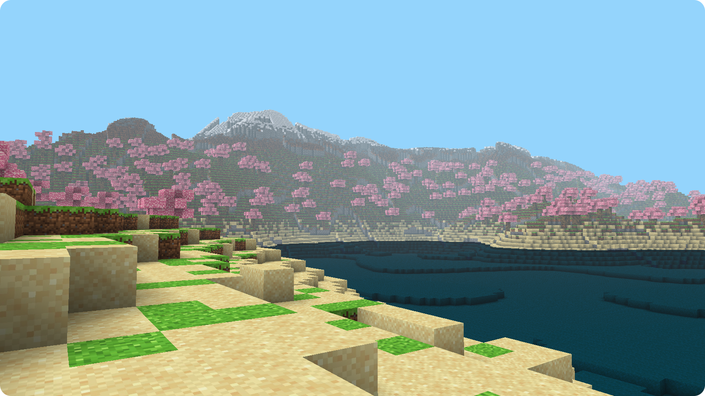

# python-voxel-engine

Voxel engine made using Python, Pygame and OpenGL



## Introduction

This project enables you to generate and render voxel-based 3D worlds, which can be a foundation for various games, simulations, or interactive 3D applications.

## Prerequisites

Before you can use this program, you need to ensure that you have the following prerequisites installed:

-   Python
-   Poetry

To install Poetry, you can use pip:

```sh
pip install poetry
```

## Usage

1. Clone this repo.
2. Navigate to the project folder.
3. Run the program using Poetry:

```sh
poetry run python src/main.py
```

## Controls

- **Mouse:** Control the camera's orientation. Move the mouse to look around and explore the game world from different angles.
- **W:** Move forward, advancing in the direction you're facing.
- **A:** Move to the left.
- **D:** Move to the right.
- **S:** Move backward.
- **Space:** Go upward or ascend.
- **Left Control:** Go downward or descend.
- **Escape:** Exit the program.
